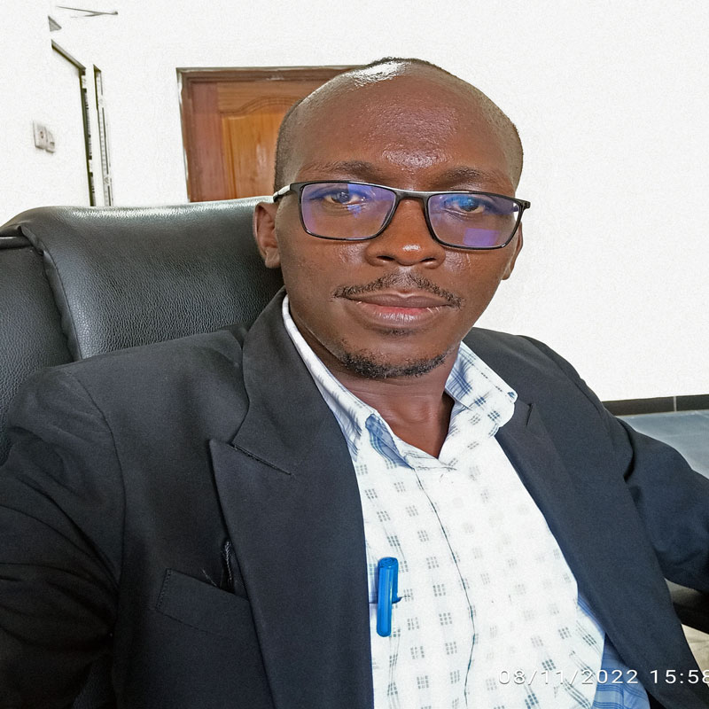

# PERSONAL INFORMATION:

**NAME:** BENJAMINI ANDREA MPINGA
 
**BIRTH:** 16 -- 07 -- 1990
 
**PLACE OF BIRTH:** ARUSHA,TANZANIA
 
**MARITAL STATUS:** MARRIED
 
**RELIGION:** CHRISTIANITY
 
**NATIONALITY:** TANZANIAN

# ADDRESS AND CONTACT INFORMATION:

**RESIDENCE:** KIGAMBONI,DAR ES SALAAM

**CELL PHONE:** +255 679 767 645

**WHATSAPP CONTACT:** +255 768 596 017
 
**E-mail Address:** benjaminindrw@gmail.com

# EDUCATION BACKGROUND INFORMATION:

**UNIVERSITY EDUCATION:** BRINGHAM YOUNG UNIVERSITY (BYU) -- (Pathway -- Connect Program) Ongoing 

**COLLAGE EDUCATION:** ALLIANCE FRANCAISE -- From 2012 to 2016.

**HIGHER EDUCATION:** MOUNTAIN -- From 2009 to 2011.

**SECONDARY EDUCATION:**  MRINGA SECONDARY SCHOOL -- From 2005 to 2008.                            

**PRIMARY EDUCATION:** MAMBA PRIMARY SCHOOL -- From 1998 to 2004.

# SKILLS AND KNOWLEDGE:

## R PROGRAMING LANGUAGE AND QUARTO:

I am skilled in several Programming Languages. Begin with R programming language this is one of the best language when it comes to Statistical data analysis. Apart from data analysis, 

R language also offers very essential platform for bloggers where you can create blogs and website as well as making all your web development without complications, 

Document preparations and reports. You can prepare a beautiful presentation and reports and share them through several format such as pdf, word and html. All this format can be generated from a single source (Rstudio). On the other hand..

Quarto is a an embedded multiple programming language which can be accessible on R as well as other languages like **Jupiter and Python.** Therefor On Rstudio through Quarto, you can choose to interact with whatever language you are familiar with, without need of changing your cording skills and steal come out with the same result you want.

## DATA AND STATISTICAL ANALYSIS.

Apart from Having a fundamental Skills in R programming language, i also have technical skills for the following areas in data analysis,

1. Data Collection,
1. Data importation,
1. Data Manipulation,
1. Data visualization and 
1. Data Interpretation.

Data analysis is the huge industry, its nature comes from Math Statistics, In modern world where people;e rely on data based decisions, then without having clear insight about collected data, then you might also fail to reach a scientific driven decisions. So after having data you also need to have skills to analyze them. So you will need a tool for analysis, and that is non other than a person with technical skills for data analysis. 

## BLOG CREATION AND DEVELOPMENT.

I am also a good blog developer, and being realistic about the rapid change of technology, i always use my extra time to improve my blogging and other online soft skills, so that i can stay relevant to the modern world. As a part of my work here are my Blog links, one for the Technical information, which provide all information about key issues on different areas including R knowledge. Another is for the social matters, where i usually share my thoughts about God and other social stories. All these activities are done by my self and through R programming Language and Quarto.

- Follow me > **Technical Link address:** https://tenesom.github.io/Benjamini-teneson/
- Follow me > **Social Link address:** https://tenesom.github.io/benjamini-mpinga/blog.html

## CONTENT WRITING.

I usually generate an idea tor online content before i put it in writing, this daily assignment has developed my capacity to help many people in their projects and reports. By sharing ideas i have now become key speaker in my street community as well as chairing a committee for agenda preparation in my  social group at district level.

## LEGAL AFFAIR.

During my collage years, i was Trained to handle legal matter which among many i was competent in some few categories as mentioned hereunder..

1. Contract Law
1. Marriage and Family Law
1. Principles of natural Justice
1. Mediation and Arbitration
1. Conflict Resolutions and
1. Element of Criminology

## TOURISM AND TOUR GUIDING.

In my higher education after secondary school, i had an opportunity to study  a certificate in Tourism and tour guiding ethic studies, introduction to animal behaviors, species and plants classification as well as Parks Regulations in Tanzania.

# LANGUAGE:

I am also a mult language speaker, Begin with my native language of Swahili which i am a good writer and speaker, i also both write and speak English, French and currently i am a student of Spanish Language.

**1. KISWAHILI:** Native Speaker

**1. ENGLISH:** Fluent Speaker and a good Writer

**1. FRENCH:** Fluent Speaker

**1. SPANISH:** Current a Student

# HOBIES:

- I usually spend my extra time to write some posts on my blogs 
- I also spare time to read books, especially research based information 
- I curiously read Bible as often as i could, as well as having enough time to discuss with my family
- Sometimes i spend time to exchange ideas with my friends either physically or through phone 

# REFEREES INFORMATION:

**DR.MASUMBUKO LUGOGA SEMBA**

**DR.ISMAEL KIMREI**

**DR.CHALES CHACHA**

**MRS.NYAMISI PETTER MOMBIA**

**MR GABRIEL NGERO**

# CONCLUSION:

This curriculum Vitae (CV), describe in detail all the current and relevant information about my self, which basically consist of Formal certified skills and informal, all the skills which are related to Technology, i attained them through my personal effort and online provided skills. All formal certificate i can provide are those of my Education background. Unfortunately i am now competent in Tech field than those of area of my Professional.

